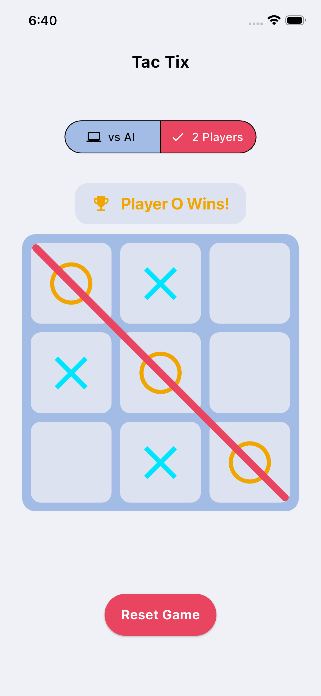
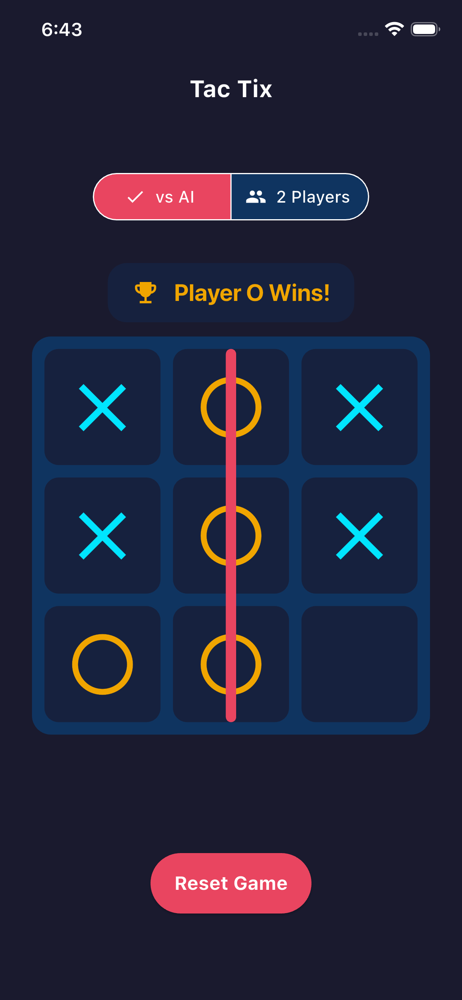

# TicTax

A classic Tic-Tac-Toe game built with Flutter, designed as a case study in building scalable, maintainable, and responsive applications using professional-grade architecture.
The app features two game modes (Player vs. Player and Player vs. AI), a fully responsive, theme-aware UI, and smooth, polished animations.

---

## 🚀 Core Features

- Responsive UI: Adapts to all screen sizes using a responsive layout system built with LayoutBuilder (no external packages).
- Dual Game Modes: Play against a friend (Player vs. Player) or challenge the AI (Player vs. AI).
- Talented AI: The AI isn't just random; it follows a heuristic algorithm (win, block, center, corner) to be a challenging opponent.
- Polished Animations: Features a smooth, animated winning line, animated "X" and "O" placements, and fluid state changes.
- Theme-Aware: Includes a full custom theme system (ThemeManager) with support for both Light and Dark modes.

---

## 🏛️ Technical Architecture

This project is built to demonstrate a highly scalable and decoupled architecture.

- **Clean Architecture:** The codebase is separated into three distinct layers (Domain, Data, and Presentation) to ensure a complete separation of concerns.
- **BLoC State Management:** The entire app state is managed using the BLoC (Business Logic Component) pattern, ensuring a unidirectional data flow that is predictable, testable, and easy to debug.
- **Dependency Injection (DI):** Uses **get_it** and **injectable** to manage all dependencies (UseCases, Repositories, BLoCs), making the code fully decoupled.
- **Concurrency with Isolates:** The AI's "thinking" is performed in a separate isolate using **compute()**. This guarantees the heavy computation never blocks the main UI thread, keeping the app smooth and responsive.
- **Custom Theme Engine:** All UI values (colors, text styles, sizes) are managed in a central **resource** folder (**ColorManager**, **StyleManager**, **ValuesManager**) and applied via a **ThemeManager**.

---

## 📂 Project Structure
```bash
lib/
├── data/
│   └── repositories/       # AI logic implementation
├── domain/
│   ├── entities/           # Pure Dart objects (Player, GameResult, etc.)
│   ├── repositories/       # Abstract repository interfaces
│   └── usecases/           # Core business logic (CheckWinnerUseCase, etc.)
├── presentation/
│   ├── bloc/               # All BLoC files (bloc, event, state)
│   ├── pages/              # The main game page (StatefulWidget)
│   ├── resource/           # Theme, Colors, Styles, and Values
│   └── widgets/            # Reusable UI parts (BoardWidget, CellWidget, etc.)
├── core/
│   └── locator/            # Dependency injection setup
├── application/            # App entry point and theme setup
└── main.dart               # Main
```
---

## 📱 Screenshots

| Light Mode | Dark Mode |
| :---: | :---: |
|  |  |

---

## 📦 Installation
1. Clone the repository:
   ```bash
   git clone https://github.com/<your-username>/tictax.git
   cd note_ninja